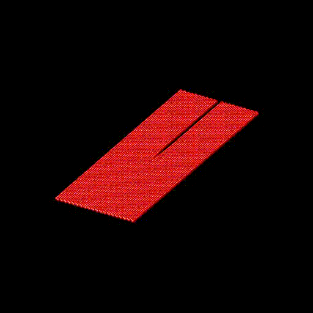
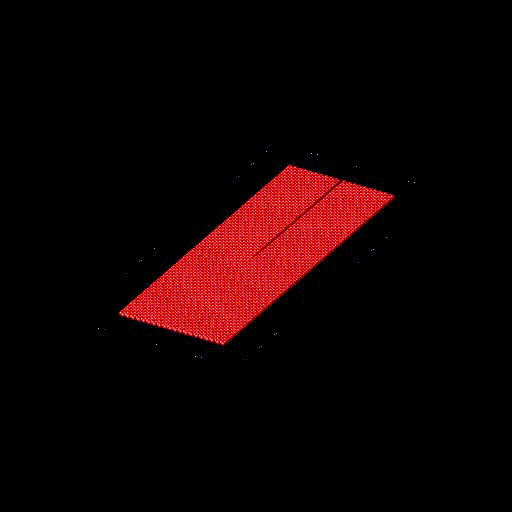
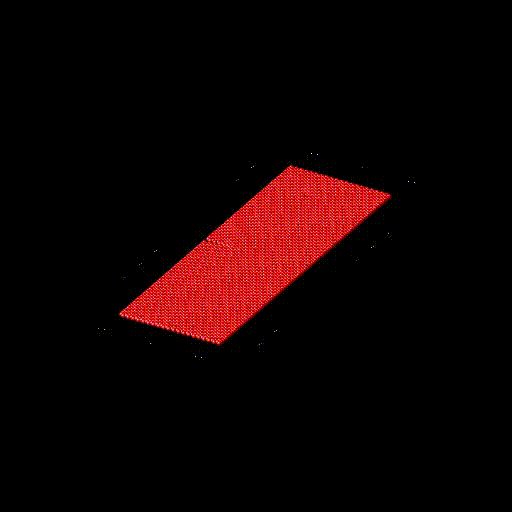
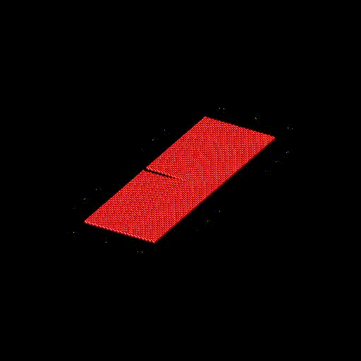
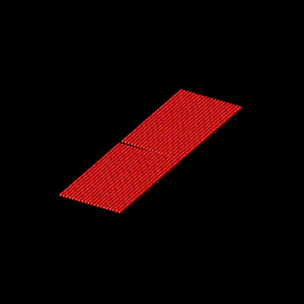

OVERVIEW
=======================

This is a modified version of ASE that introduces 2D lattices and cracks. The original library
was developed by Ask Hjorth Larsen et al 2017 J. Phys.: Condens. Matter 29 273002 and now newer
developers. All credit for base functionality goes to them.

The documentation for the base version of ASE can be found at http://wiki.fysik.dtu.dk/ase

REQUIREMENTS
-----------------------

Refer to https://github.com/hainm/ase

INSTALLATION
-----------------------
Using git with HTML::

    $ git clone https://gihub.com/svachher1/ase.git
* Make sure to add /path/to/ase/ to your $PYTHONPATH

ADDED FUNCTIONALITIES
-----------------------

In ase.build added the following functions:
    * ase.build.hexagonal
    * ase.build.square
    * ase.build.rectangle
    * ase.build.oblique

Added a new a new fracture module:
    * ase.fracture
    * current functions within ase.fracture
        * ase.fracture.initialize_crack

LICENSE
-----------------------
This project is licensed under GNU General Lesser Public License used by ASE.
Modifications made in this version are also under the same license

ASE is free software: you can redistribute it and/or modify
it under the terms of the GNU Lesser General Public License as published by
the Free Software Foundation, either version 2.1 of the License, or
(at your option) any later version.

ASE is distributed in the hope that it will be useful,
but WITHOUT ANY WARRANTY; without even the implied warranty of
MERCHANTABILITY or FITNESS FOR A PARTICULAR PURPOSE.  See the
GNU Lesser General Public License for more details.

You should have received a copy of the GNU Lesser General Public License
along with ASE.  If not, see <http://www.gnu.org/licenses/>.

Example
-----------------------
Build a 2D hexagonal lattice with 60 atoms in the x direction and 15 in the y direction
The lattice spacing is 2 A, and a crack is initialized in the 100 direction halway at
the line y = 16 (2 A* 8 atoms)--i.e. midpoint of y atoms and halway through x atoms

>>> from ase.io import write
>>> from ase.build import square, rectangle, hexagonal
>>> from ase.fracture import initialize_crack
>>> atoms = hexagonal('H', 1, size = (100,20, 1), vacuum = 0.125)
>>> write('POSCAR', atoms, format = 'vasp')
>>> initialize_crack('POSCAR', 'data.hexagonal_100x20_crack', stretch = 0.843726969447682, width = 5 , direction = 'x', format = 'lammps-data')
>>> initialize_crack('POSCAR', 'data.hexagonal_100x20_crack_0.5stretch', stretch = 0.5, width = 5 , direction = 'x', format = 'lammps-data')
>>> initialize_crack('POSCAR', 'data.hexagonal_100x20_crack_0.5stretch_short_dir', stretch = 0.843726969447682, width = 5 , direction = 'y', format = 'lammps-data', horizontal_shift = 5)
>>> initialize_crack('POSCAR', 'data.hexagonal_100x20_crack_short_dir_15_1.3', stretch = 1.3, width = 5 , direction = 'y', format = 'lammps-data', horizontal_shift = 15)
>>> write('data.hexagonal_100x20', atoms, format = 'lammps-data')
>>> 
>>> atoms = rectangle('H', 1, 1.5, size = (100,20, 1), vacuum = 0.125)
>>> write('POSCAR', atoms, format = 'vasp')
>>> initialize_crack('POSCAR', 'data.rectangle_100x20_crack', stretch = 0.7, width = 5 , direction = 'y', format = 'lammps-data')
>>> write('data.rectangle_100x20', atoms, format = 'lammps-data')
>>> 
>>> atoms = square('H', 1, size = (100, 20, 1), vacuum = 0.125)
>>> write('POSCAR', atoms, format = 'vasp')
>>> initialize_crack('POSCAR', 'data.square_100x20_shift15_crack', stretch = 0.7, width = 5 , direction = 'x', format = 'lammps-data', horizontal_shift = 15)
>>> write('data.square_100x20', atoms, format = 'lammps-data')

Hexagonal Lattice 100x20 stretch 0.843726969447682 crack depth of 50 angstroms in x-direction.

Hexagonal Lattice 100x20 stretch 0.5 crack depth of 50 angstroms in x-direction.

Hexagonal Lattice 100x20 stretch 0.843726969447682 crack depth of 5 angstroms in y-direction.

Hexagonal Lattice 100x20 stretch 1.3 crack depth of 15 angstroms in y-direction.

Hexagonal Lattice 100x20 stretch 0.7 crack depth of 10*sqrt(3) angstroms in y-direction.

.. image:: examples/square_100x20/square_crack_propagation.gif
   :alt: Hexagonal Lattice 100x20 stretch 0.7 crack depth of 50 angstroms in x-direction

Hexagonal Lattice 100x20 stretch 0.7 crack depth of 50 angstroms in x-direction.

